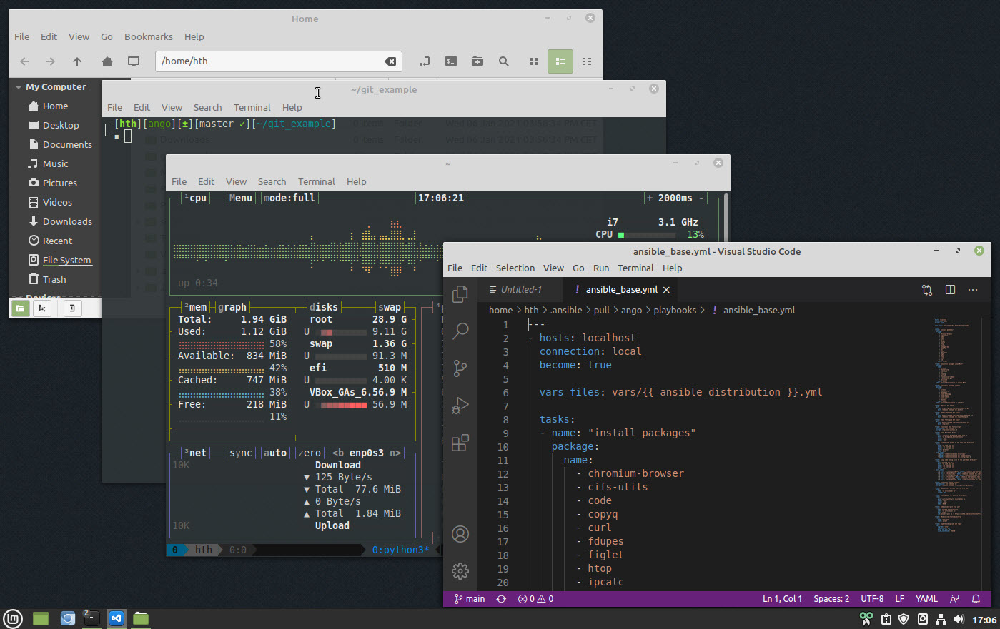

## Linux Mint/Ubuntu Grundkonfiguration mit Shell-Skripte und Ansible

#### Beschreibung
Hier eine kurze Anleitung wie man das Repository nutzen kann. Nachdem man sich eine Linux Maschine installiert hat. Kann man nach dem ersten Login folgenden Befehle ausführen. Diese konfiguriert dann die Linux Maschine über ein Shell-Skript und Ansible fertig.

* Linux Ubuntu 20.04.1 LTS mit Unity Desktop
* Linux Mint 20 mit Cinnamon Desktop

<a href="ubuntu-mint/images/ubuntu.jpg" target="_blank"></a>   <a href="ubuntu-mint/images/mint.jpg" target="_blank"></a>

 Der erste Lauf des Playbooks kann ein bisschen dauern. Am Ende des Playbooks werden auf Seiten von Ubuntu ca. 280 Pakete und auf Seiten von Linux Mint ca. 390 Pakete upgegradet.

#### Linux System vorbereiten und Playbook ausführen
```console
# Ubuntu und Linux Mint
hth@gao:~$ wget -O - https://raw.githubusercontent.com/hth73/ansible-wks/main/ubuntu-mint/scripts/install_base.sh | bash

# Zorin OS
hth@gao:~$ wget -O - https://raw.githubusercontent.com/hth73/ansible-wks/main/zorin/scripts/install_base.sh | bash
```

#### Wenn man das Playbook ausprobieren möchte, dienen folgende Befehle
```console
## Um das Ansible Playbook bei euch Anwenden zu können, muss die "username" Variable mit euren Benutzernamen überschrieben werden.
##
myuser@myhost:~$ wget -O - https://raw.githubusercontent.com/hth73/ansible-wks/main/ubuntu-mint/scripts/install_base_username.sh | bash
myuser@myhost:~$ ansible-pull -U https://github.com/hth73/ansible-wks.git ubuntu-mint/playbooks/ansible_base.yml --extra-vars="username='$USER'" --ask-become-pass 
```

#### scripts/install_base.sh
```bash
#!/usr/bin/env bash
set -e

# ======================================================================
#   Bash script to Install Base Packages on a Linux Mint/Ubuntu System
# ======================================================================

# Add Microsoft gpg Key to Keyring
echo '# === Add Microsoft gpg Key to Keyring === #'
wget -qO- https://packages.microsoft.com/keys/microsoft.asc | gpg --dearmor > packages.microsoft.gpg
sudo install -o root -g root -m 644 packages.microsoft.gpg /etc/apt/trusted.gpg.d/
sudo sh -c 'echo "deb [arch=amd64,arm64,armhf signed-by=/etc/apt/trusted.gpg.d/packages.microsoft.gpg] https://packages.microsoft.com/repos/code stable main" > /etc/apt/sources.list.d/vscode.list'

# System Update
echo '# === System Update === #'
sudo apt update

# Install Base Packages
echo '# === Install base packages === #'
sudo apt install linux-headers-$(uname -r) build-essential apt-transport-https software-properties-common powerline dkms ssh git python3 python3-pip python-apt ansible -y
sudo pip3 install bpytop --upgrade

# Install Ansible Base Packages
echo '# === Install Ansible Base Packages === #'
ansible-pull -U https://github.com/hth73/ansible-wks.git playbooks/ansible_base.yml
```

#### scripts/install_base_username.sh
```bash
#!/usr/bin/env bash
set -e

# ======================================================================
#   Bash script to Install Base Packages on a Linux Mint/Ubuntu System
# ======================================================================

# Add Microsoft gpg Key to Keyring
echo '# === Add Microsoft gpg Key to Keyring === #'
wget -qO- https://packages.microsoft.com/keys/microsoft.asc | gpg --dearmor > packages.microsoft.gpg
sudo install -o root -g root -m 644 packages.microsoft.gpg /etc/apt/trusted.gpg.d/
sudo sh -c 'echo "deb [arch=amd64,arm64,armhf signed-by=/etc/apt/trusted.gpg.d/packages.microsoft.gpg] https://packages.microsoft.com/repos/code stable main" > /etc/apt/sources.list.d/vscode.list'

# System Update
echo '# === System Update === #'
sudo apt update

# Install Base Packages
echo '# === Install base packages === #'
sudo apt install linux-headers-$(uname -r) build-essential apt-transport-https software-properties-common dkms ssh git python3 python3-pip python-apt ansible -y
sudo pip3 install bpytop --upgrade
```

#### playbooks/vars/Linux Mint.yml
```yaml
---
username: <USERNAME>
serviceuser: <SERVICEUSERNAME>
background_image_name: background_mint.jpg
background_destination: /usr/share/backgrounds/linuxmint/background.jpg
```

#### playbooks/vars/Ubuntu.yml
```yaml
---
username: <USERNAME>
serviceuser: <SERVICEUSERNAME>
background_image_name: background_ubuntu.jpg
background_destination: /usr/share/backgrounds/background.jpg
```

#### playbooks/ansible_base.yml
```yaml
---
- hosts: localhost
  connection: local
  become: true

  vars_files: vars/{{ ansible_distribution }}.yml

  tasks:
  - name: "install packages"
    package: 
      name:
        - chromium-browser
        - cifs-utils
        - code
        - copyq
        - curl
        - fdupes
        - figlet
        - htop
        - ipcalc
        - manpages-de
        - members
        - mmv
        - ncdu
        - net-tools
        - pwgen
        - tmux
        - tree
        - unzip
        - vim
      state: latest

  - name: "uninstall packages Linux Mint"
    package: 
      name:
        - firefox
        - thunderbird
        - rhythmbox
        - pix
        - drawing
        - hexchat
        - transmission-common
        - transmission-gtk
        - celluloid
      state: absent
    when: ansible_distribution == "Linux Mint"

  - name: "uninstall packages ubuntu"
    package: 
      name:
        - firefox
        - thunderbird
        - rhythmbox
        - gnome-mahjongg
        - gnome-mines
        - gnome-sudoku
        - aisleriot
        - shotwell
      state: absent
    when: ansible_distribution == "Ubuntu"

  - name: "bash-it - Git Clone"
    git:
      repo: https://github.com/Bash-it/bash-it.git
      dest: /home/{{ username }}/.bash.it

  - name: "tmux-themepack - Git Clone"
    git:
      repo: https://github.com/jimeh/tmux-themepack.git
      dest: /home/{{ username }}/.tmux-themepack

  - name: "tmux fonts pack - Git Clone"
    git:
      repo: https://github.com/powerline/fonts.git
      dest: /tmp/fonts

  - name: "run local tmux fonts script"
    become_user: '{{ username }}'
    script: /tmp/fonts/install.sh

  - name: "copy Wallpaper File"
    copy:
      src: ../files/{{ background_image_name }}
      dest: '{{ background_destination }}'
      owner: 'root'
      group: 'root'

  - name: "create some folder to the user home directory"
    file:
      path: '{{ item.path }}' 
      owner: '{{ username }}'
      group: '{{ username }}'
      state: directory
      mode: '0755'
    with_items:
      - {path: '/home/{{ username }}/scripts'}
      - {path: '/home/{{ username }}/.config/bpytop'}
      - {path: '/home/{{ username }}/.config/copyq'}

  - name: "copy some config files to the user home directory"
    copy: 
      src: '{{ item.src }}' 
      dest: '{{ item.dest }}'
      owner: '{{ username }}'
      group: '{{ username }}'
      mode: '0755'
    with_items:
      - { src: '../files/config_base', dest: '/home/{{ username }}/scripts/config_base.sh' }
      - { src: '../files/bashrc', dest: '/home/{{ username }}/.bashrc' }
      - { src: '../files/vimrc', dest: '/home/{{ username }}/.vimrc' }
      - { src: '../files/gitconfig', dest: '/home/{{ username }}/.gitconfig' }
      - { src: '../files/tmux', dest: '/home/{{ username }}/.tmux.conf' }
      - { src: '../files/copyq', dest: '/home/{{ username }}/.config/copyq/copyq.conf' }
      - { src: '../files/bpytop', dest: '/home/{{ username }}/.config/bpytop/bpytop.conf' }

  - name: "run local config script"
    become_user: '{{ username }}'
    script: /home/{{ username }}/scripts/config_base.sh

  - name: "add ansible service user for cron job"
    user:
      name: '{{ serviceuser }}'
      system: yes

  - name: "set up sudo for ansible service user"
    copy:
      src: ../files/sudoer_{{ serviceuser }}
      dest: /etc/sudoers.d/{{ serviceuser }}
      owner: 'root'
      group: 'root'
      mode: '0440'

  - name: "add ansible-pull cron job"
    cron:
      name: ansible auto-provision
      user: '{{ serviceuser }}'
      hour: "*/3"
      job: ansible-pull -o -U https://github.com/hth73/ansible-wks.git playbooks/ansible_base.yml

  - name: "Remove /tmp/fonts directory"
    file:
      path: /tmp/fonts
      state: absent

  - name: "update and upgrade apt repo"
    apt:
      upgrade: 'safe'
      update_cache: yes 
      force_apt_get: yes 
      cache_valid_time: '43200'
```

#### files/config_base.sh
```bash
#!/usr/bin/env bash
set -e

# ======================================================================
#   Bash script to set desktop and nemo/nautilus settings
# ======================================================================

source /etc/os-release

if [[ "$NAME" = "Ubuntu" ]]; 
then
  gsettings set org.gnome.desktop.background picture-uri 'file:///usr/share/backgrounds/background_ubuntu.jpg'
  gsettings set org.gnome.desktop.background picture-options 'zoom'
  gsettings set org.gnome.desktop.screensaver picture-uri 'file:///usr/share/backgrounds/background_ubuntu.jpg'
  gsettings set org.gnome.desktop.screensaver picture-options 'zoom'

  gsettings set org.gnome.nautilus.preferences default-folder-viewer 'list-view'
  gsettings set org.gnome.nautilus.preferences always-use-location-entry true
  gsettings set org.gnome.nautilus.list-view default-zoom-level 'small'
  gsettings set org.gtk.Settings.FileChooser show-hidden true

  gsettings set org.gnome.shell.extensions.desktop-icons show-home false
  gsettings set org.gnome.shell.extensions.desktop-icons show-trash false
  gsettings set org.gnome.shell.extensions.dash-to-dock dash-max-icon-size '28'
  gsettings set org.gnome.shell.extensions.dash-to-dock show-trash true

  gsettings set org.gnome.desktop.screensaver lock-enabled false

elif [[ "$NAME" = "Linux Mint" ]]
then
  gsettings set org.cinnamon.desktop.background picture-uri 'file:///usr/share/backgrounds/linuxmint/background_mint.jpg'
  gsettings set org.cinnamon.desktop.background picture-options 'zoom'
  gsettings set org.mate.background picture-filename 'file:///usr/share/backgrounds/linuxmint/background_mint.jpg'
  gsettings set org.mate.background picture-options 'zoom'

  gsettings set org.nemo.preferences show-computer-icon-toolbar true
  gsettings set org.nemo.preferences show-open-in-terminal-toolbar true
  gsettings set org.nemo.preferences show-new-folder-icon-toolbar true
  gsettings set org.nemo.preferences show-edit-icon-toolbar true
  gsettings set org.nemo.preferences show-home-icon-toolbar true
  gsettings set org.nemo.preferences show-hidden-files true
  gsettings set org.nemo.preferences default-folder-viewer 'list-view'
  gsettings set org.nemo.preferences inherit-folder-viewer true
  gsettings set org.nemo.preferences show-location-entry true

  gsettings set org.nemo.desktop computer-icon-visible false
  gsettings set org.nemo.desktop home-icon-visible false
  gsettings set org.nemo.desktop volumes-visible false
  gsettings set org.nemo.desktop show-orphaned-desktop-icons false

  gsettings set org.cinnamon.desktop.screensaver lock-enabled false

  gsettings set org.cinnamon panels-height "['1:28']" 

else
  echo "Das Betriebssystem ist weder ein Ubuntu noch ein Linux Mint, das Script wird beendet."

fi
```

#### files/sudoer_sansible
```bash
sansible ALL=(ALL) NOPASSWD: ALL
```

### License and Authors
Author: Helmut Thurnhofer