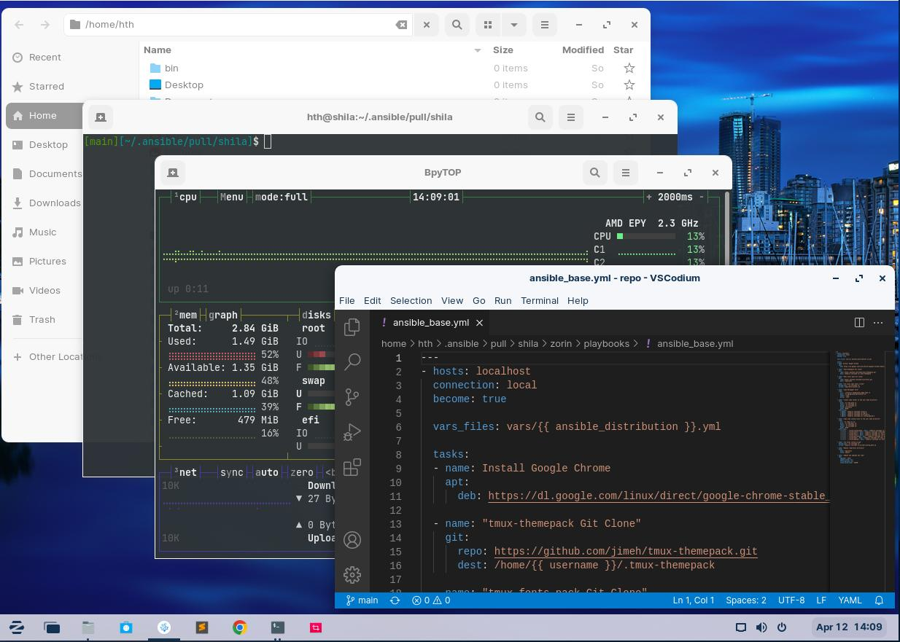

## Linux Zorin OS Grundkonfiguration mit Shell-Skripte und Ansible
Hier eine kurze Anleitung wie man das Repository nutzen kann.

  

---
## Beschreibung
Nachdem man sich eine Linux Maschine installiert hat. Nach dem ersten Login wird folgender Befehl ausführen. Diese konfiguriert dann die passende Linux Maschine über ein Shell-Skript und Ansible fertig.

<a href="images/zorin.jpg" target="_blank"></a>

 Der erste Lauf des Playbooks kann ein bisschen dauern.

### Linux System vorbereiten und Playbook ausführen
```bash
# Zorin OS
hth@gao:~$ wget -O - https://raw.githubusercontent.com/hth73/ansible-wks/main/zorin/scripts/install_base.sh | bash
```

#### Wenn man das Playbook ausprobieren möchte, dienen folgende Befehle
```bash
## Um das Ansible Playbook bei euch Anwenden zu können, muss die "username" Variable mit euren Benutzernamen überschrieben werden.
##
myuser@myhost:~$ wget -O - https://raw.githubusercontent.com/hth73/ansible-wks/main/zorin/scripts/install_base_username.sh | bash

myuser@myhost:~$ ansible-pull -U https://github.com/hth73/ansible-wks.git zorin/playbooks/ansible_base.yml --extra-vars="username='$USER'" --ask-become-pass 
```

#### scripts/install_base.sh
```bash
#!/usr/bin/env bash
set -e

# ======================================================================
#   Bash script to Install Base Packages on a Linux Zorin OS System
# ======================================================================

# System Update
echo '# === System Update === #'
sudo apt update

# Install Base Packages
echo '# === Install base packages === #'
sudo apt install linux-headers-$(uname -r) build-essential dkms ca-certificates apt-transport-https software-properties-common -y

# add packages repositories
echo '# === add packages repositories === #'
# ansible
sudo add-apt-repository --yes --update ppa:ansible/ansible
# nextcloud-client
sudo add-apt-repository --yes --update ppa:nextcloud-devs/client
#sublime-text
curl -fsSL https://download.sublimetext.com/sublimehq-pub.gpg | sudo apt-key add -
sudo add-apt-repository --yes --update "deb https://download.sublimetext.com/ apt/stable/"
# codium
wget -qO - https://gitlab.com/paulcarroty/vscodium-deb-rpm-repo/raw/master/pub.gpg | gpg --dearmor | sudo dd of=/usr/share/keyrings/vscodium-archive-keyring.gpg
echo 'deb [ signed-by=/usr/share/keyrings/vscodium-archive-keyring.gpg ] https://download.vscodium.com/debs vscodium main' | sudo tee /etc/apt/sources.list.d/vscodium.list

# Uninstall default zorin packages
echo '# === Uninstall default packages === #'
sudo apt remove --purge firefox firefox-locale-en aisleriot gnome-mahjongg gnome-mines quadrapassel gnome-sudoku gimp gimp-help-common gimp-help-en cheese pitivi gnome-sound-recorder gnome-tour zorin-gnome-tour-autostart zorin-os-tour-video -y

# Install ansible
echo '# === Install ansible packages === #'
sudo apt update
sudo apt install powerline python3 python3-pip ansible -y

# Install useful tools
echo '# === Install common tools packages === #'
sudo apt install ssh git dirmngr gnupg direnv zsh ssh vim git tree curl lsof net-tools pwgen ncdu tmux unzip ipcalc figlet manpages-de deepin-screenshot sublime-text nextcloud-client codium -y

# Install bpytop
echo '# === Install bpytop packages === #'
sudo pip3 install bpytop --upgrade

# Install Ansible Base Packages
echo '# === Install Ansible Base Packages === #'
ansible-pull -U https://github.com/hth73/ansible-wks.git zorin/playbooks/ansible_base.yml
```

#### scripts/install_base_username.sh
```bash
#!/usr/bin/env bash
set -e

# ======================================================================
#   Bash script to Install Base Packages on a Linux Zorin OS System
# ======================================================================

# System Update
echo '# === System Update === #'
sudo apt update

# Install Base Packages
echo '# === Install base packages === #'
sudo apt install linux-headers-$(uname -r) build-essential dkms ca-certificates apt-transport-https software-properties-common -y

# add packages repositories
echo '# === add packages repositories === #'
# ansible
sudo add-apt-repository --yes --update ppa:ansible/ansible
# nextcloud-client
sudo add-apt-repository --yes --update ppa:nextcloud-devs/client
#sublime-text
curl -fsSL https://download.sublimetext.com/sublimehq-pub.gpg | sudo apt-key add -
sudo add-apt-repository --yes --update "deb https://download.sublimetext.com/ apt/stable/"
# codium
wget -qO - https://gitlab.com/paulcarroty/vscodium-deb-rpm-repo/raw/master/pub.gpg | gpg --dearmor | sudo dd of=/usr/share/keyrings/vscodium-archive-keyring.gpg
echo 'deb [ signed-by=/usr/share/keyrings/vscodium-archive-keyring.gpg ] https://download.vscodium.com/debs vscodium main' | sudo tee /etc/apt/sources.list.d/vscodium.list

# Uninstall default zorin packages
echo '# === Uninstall default packages === #'
sudo apt remove --purge firefox firefox-locale-en aisleriot gnome-mahjongg gnome-mines quadrapassel gnome-sudoku gimp gimp-help-common gimp-help-en cheese pitivi gnome-sound-recorder gnome-tour zorin-gnome-tour-autostart zorin-os-tour-video -y

# Install ansible
echo '# === Install ansible packages === #'
sudo apt update
sudo apt install powerline python3 python3-pip ansible -y

# Install useful tools
echo '# === Install common tools packages === #'
sudo apt install ssh git dirmngr gnupg direnv zsh ssh vim git tree curl lsof net-tools pwgen ncdu tmux unzip ipcalc figlet manpages-de deepin-screenshot sublime-text nextcloud-client codium chromium-browser -y

# Install bpytop
echo '# === Install bpytop packages === #'
sudo pip3 install bpytop --upgrade
```

#### playbooks/vars/Zorin OS.yml
```yaml
---
username: <USERNAME>
background_image_name: background_zorin.jpg
background_destination: /usr/share/backgrounds/background_zorin.jpg
```

#### playbooks/ansible_base.yml
```yaml
---
- hosts: localhost
  connection: local
  become: true

  vars_files: vars/{{ ansible_distribution }}.yml

  tasks:
  - name: Install Google Chrome
    apt:
      deb: https://dl.google.com/linux/direct/google-chrome-stable_current_amd64.deb

  - name: "tmux-themepack Git Clone"
    git:
      repo: https://github.com/jimeh/tmux-themepack.git
      dest: /home/{{ username }}/.tmux-themepack

  - name: "tmux fonts pack Git Clone"
    git:
      repo: https://github.com/powerline/fonts.git
      dest: /tmp/fonts

  - name: "run local tmux fonts script"
    become_user: '{{ username }}'
    script: /tmp/fonts/install.sh

  - name: "copy Wallpaper File"
    copy:
      src: ../files/{{ background_image_name }}
      dest: '{{ background_destination }}'
      owner: 'root'
      group: 'root'

  - name: "create some folder to the user home directory"
    file:
      path: '{{ item.path }}' 
      owner: '{{ username }}'
      group: '{{ username }}'
      state: directory
      mode: '0755'
    with_items:
      - {path: '/home/{{ username }}/bin'}
      - {path: '/home/{{ username }}/repo'}     
      - {path: '/home/{{ username }}/scripts'}
      - {path: '/home/{{ username }}/.config/bpytop'}

  - name: "copy some config files to the user home directory"
    copy: 
      src: '{{ item.src }}' 
      dest: '{{ item.dest }}'
      owner: '{{ username }}'
      group: '{{ username }}'
      mode: '0755'
    with_items:
      - { src: '../files/config_base', dest: '/home/{{ username }}/scripts/config_base.sh' }
      - { src: '../files/zshrc', dest: '/home/{{ username }}/Documents/zshrc' }
      - { src: '../files/envrc', dest: '/home/{{ username }}/.envrc' }
      - { src: '../files/vimrc', dest: '/home/{{ username }}/.vimrc' }
      - { src: '../files/gitconfig', dest: '/home/{{ username }}/.gitconfig' }
      - { src: '../files/tmux', dest: '/home/{{ username }}/.tmux.conf' }
      - { src: '../files/bpytop', dest: '/home/{{ username }}/.config/bpytop/bpytop.conf' }

  - name: "run local config script"
    become_user: '{{ username }}'
    script: /home/{{ username }}/scripts/config_base.sh

  - name: "Remove /tmp/fonts directory"
    file:
      path: /tmp/fonts
      state: absent

  - name: "update and upgrade apt repo"
    apt:
      upgrade: 'safe'
      update_cache: yes 
      force_apt_get: yes 
      cache_valid_time: '43200'
```

#### files/config_base.sh
```bash
#!/usr/bin/env bash
set -e

# ======================================================================
#   Bash script to set desktop and nautilus settings
# ======================================================================

source /etc/os-release

if [[ "$NAME" = "Zorin OS" ]];

then
  gsettings set org.gnome.desktop.background picture-uri 'file:///usr/share/backgrounds/background_zorin.jpg'
  gsettings set org.gnome.desktop.background picture-options 'zoom'
  gsettings set org.gnome.desktop.screensaver picture-uri 'file:///usr/share/backgrounds/background_zorin.jpg'
  gsettings set org.gnome.desktop.screensaver picture-options 'zoom'

  gsettings set org.gnome.nautilus.preferences default-folder-viewer 'list-view'
  gsettings set org.gnome.nautilus.preferences always-use-location-entry true
  gsettings set org.gnome.nautilus.list-view default-zoom-level 'small'
  gsettings set org.gtk.Settings.FileChooser show-hidden true

  gsettings set org.gnome.shell.extensions.zorin-desktop-icons show-home false
  gsettings set org.gnome.shell.extensions.zorin-desktop-icons show-trash false
  gsettings set org.gnome.shell.extensions.zorin-taskbar panel-size '36'

  gsettings set org.gnome.desktop.screensaver lock-enabled false

else
  echo "Das Betriebssystem ist kein Zorin OS, das Script wird beendet."
  exit 0

fi
```

### License and Authors
Author: Helmut Thurnhofer
